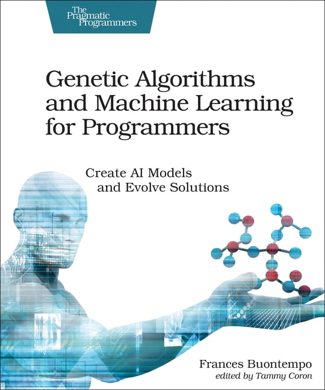

# EE6407-Genetic-Algorithms-And-Machine-Learning-Content (Ongoing)

# 1.Introduction

This course, **EE6407 - Genetic Algorithms and Machine Learning**, offers an integrated view of these two complementary domains. 

The first half of the course delves into **evolutionary algorithms**—their design, implementation, and applications in complex optimization tasks—while the second half provides a comprehensive introduction to **machine learning** paradigms, equipping students with the latest theoretical foundations and practical approaches to contemporary ML challenges. 

By blending these topics, the course ensures a holistic understanding of how to address diverse computational problems through both optimization and learning strategies, setting the stage for advanced applications and further research in this rapidly evolving field.

This repository serves as a comprehensive resource for students and enthusiasts alike. 

1. **Personal Solutions to Past Exams** – Detailed, step-by-step write-ups of previously tested questions to guide your revision and deepen conceptual understanding.
2. **PPT Example References** – Walkthroughs of example problems and exercises presented in the lecture slides, clarifying key ideas and methodologies.
3. **Analysis of Challenging Topics** – In-depth discussions and breakdowns of complex areas, helping you navigate common pitfalls and master advanced concepts.

If you happen to have a GitHub account and find this repository helpful, please consider giving it a star⭐.



# 2.OBJECTIVE

The objective of first half of this course is to provide in-depth treatment on **optimization** procedures based on **evolutionary algorithms**. As most modern optimization problems are complex with mixed real-integer variables, numerous locally optimal solutions, discontinuities, and so on. Evolutionary algorithms can handle all these issues more effectively than other optimization algorithms.

The objective of second half of this course is to equip students with **machine learning** theories and paradigms. It gives the students an understanding of the most current machine learning algorithms such as **deep learning, kernel methods**, **randomization-based** methods so that the students can apply the knowledge to **data mining, pattern recognition and regression problems.**

# 3.CONTENT

Review of Combinatorics and Probability. 

Introduction of Genetic Algorithms.

Differential Evolution. 

Particle Swarm Optimization. 

Advanced Techniques. 

Principles of Machine Learning. 

Paradigms of Machine Learning. 

Kernel Methods.

# 4.**REFERENCES**

1. Christopher M. Bishop, Pattern Recognition and Machine Learning, Springer, 2016 (Latest Edition).

2. Trevor Hastie, Robert Tibshirani, Jerome Friedman, The Elements of Statistical Learning (Springer Series in Statistics), 9th printing, 2017.

3. Andries P. Engelbrecht, Computational Intelligence: An Introduction, Wiley, 2007

# 5.Content In Chinese

## 5.1 遗传算法

1.有待解决的问题

1.1.“黑匣子”模型

1.1.1优化

1.1.2建模

1.1.3模拟

1.2 搜索问题


1.3.优化vs.约束满足

1.3.1 目标函数

1.3.2 约束

1.3.3 COP约束优化问题

1.3.4 CSP约束满足问题

1.3.5 FOP自由问题

1.3.6 没有问题


1.4.NP问题

1.4.1 关键概念

1.4.2 P、NP、NP-complete 和 NP-hard 类

1.4.3 类之间的差异


2.进化计算:起源

2.1 历史的角度

2.2 生物学灵感

2.2.1 达尔文进化论

2.2.2 遗传学

2.3 进化计算比喻总结


3.什么是进化算法?

3.1 进化算法 方案

3.1.1 EA的总体方案

3.1.2伪代码的EA方案

3.1.3进化过程的通用模型

3.1.4进化的两个支柱


3.2 主要进化算法组件

3.2.1表示

3.2.1.1角色

3.2.1.2基因型

3.2.1.3表现型

3.2.1.4编码

3.2.1.5解码

3.2.1.6示例:用二进制代码表示整数值

3.2.2评估(适应度)功能

3.2.3人口

3.2.4选择机制

3.2.5变体算子 

3.2.6突变

3.2.7重组

3.2.8初始化/终止

3.2.9EA有哪些不同类型


3.3例子:8皇后问题

3.4 例子:f(x)=x^2

3.5 典型进化算法行为

3.6 进化计算和全局优化

3.7 进化计算及社区搜索


4.表征、突变和重组

4.1 进化算法方案:进化算法的总体方案

4.2 表示和变化操作符的作用

4.3 二进制表示

4.4整数表示

4.5实数或浮点表示

4.6排列表示

4.6.1TSP示例

4.6.2突变

4.6.3交换突变

4.6.4插入突变

4.6.5乱序突变

4.6.6反转突变

4.6.7交叉运算符

4.6.8顺序1阶交叉

4.6.9 部分映射交叉(PMX)

4.6.10 循环交叉

4.6.11 边缘重组

4.7树表示


5.适应性，选择和种群管理

5.1 进化算法方案:进化算法的总体方案

5.2人口管理模式:导论

5.3亲本选择

5.3.1适合-比例选择

5.3.2基于等级的选择

5.4基于排名的选择

5.4.1线性排名

5.4.2指数排名

5.5家长选择

5.5.1锦标赛选择

5.6统一父代选择

5.7幸存者选择

5.8健身类替换

5.9选择压力

## 5.2 机器学习

1.人工智能、机器学习、神经网络和深度学习:概览

1.机器学习简介

1.1 什么是人类学习?

1.2人类学习的类型

1.2.1在专家指导下学习

1.2.2由专家获得的知识指导的学习

1.2.3通过自学

1.3什么是机器学习?

1.3.1机器是如何学习的?

1.3.1.1抽象

1.3.1.2归纳

1.4机器学习类型

1.4.1监督学习

1.4.1.1分类

1.4.1.2.回归

1.4.2无监督学习

1.4.3强化学习

1.5机器学习的应用

1.5.1银行与金融

1.5.2 保险

1.5.3医疗保健

1.6机器学习领域的先进语言/工具

1.6.1 Python

1.6.2R

1.6.3 MATLAB

1.7机器学习问题

1.8摘要

# 6.List of Github

`````
├─1.Exam
│      .keep
│      
├─2.PPT Example
│  ├─1.GA
│  │      1.4.2 Eight-Queen-v2.pdf
│  │      1.4.2 TSP belong to NP-complete.pdf
│  │      3.3 The 8-queens problem Recombination.pdf
│  │      3.4 EC & neighbourhood search.pdf
│  │      3.4 SGA EXAMPLE f(x) = x^2.pdf
│  │      4.6.10 循环交叉.pdf
│  │      4.6.11 边缘重组.pdf
│  │      4.6.9 部分映射交叉(PMX) EXAMPLE1.pdf
│  │      4.6.9 部分映射交叉(PMX) EXAMPLE2.pdf
│  │      
│  └─2.ML
├─3.Understand
│      .keep
│      
└─4.Resource
    ├─1.OUTLINE
    │      EE6407-OUTLINE.pdf
    │      
    ├─2.EXAM-SUMMARY-CN
    │      6407考试原题.docx
    │      
    └─3.REFERENCES
            Computational Intelligence. An Introduction (Andries P. Engelbrecht) (Z-Library).pdf
            Introduction-To-Evolutionary-Computing.pdf
            Pattern Recognition and Machine Learning (Christopher M. Bishop) (Z-Library).pdf
            The Elements of Statistical Learning Data Mining, Inference, and Prediction (2nd edition) (12print 2017) (Trevor Hastie, Robert Tibshirani etc.) (Z-Library).pdf
            遗传算法-基本术语(中英文对照).pdf
`````


# 7.Disclaimer

All content in this  is based solely on the contributors' personal work, Internet data.
All tips are for reference only and are not guaranteed to be 100% correct.
If you have any questions, please submit an Issue or PR.
In addition, if it infringes your copyright, please contact us to delete it, thank you.


#### Copyright © School of Electrical & Electronic Engineering, Nanyang Technological University. All rights reserved.
