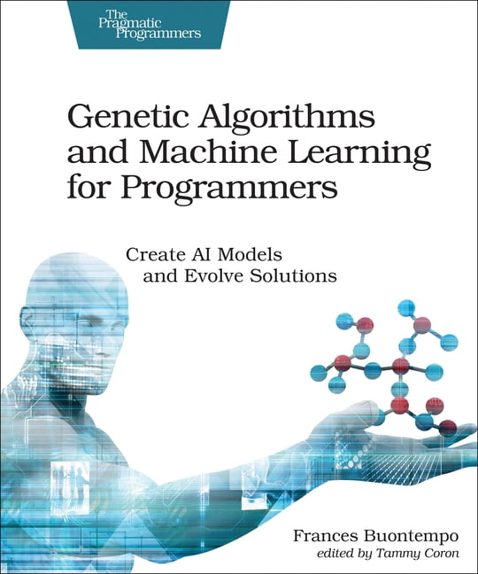

# EE6407-遗传算法与机器学习

**语言**

[English](./README.md)     [中文](./README_CN.md)

## 1.简介

本课程 **EE6407 - 遗传算法与机器学习** 为两个相辅相成的领域提供了一个综合视角。

课程的前半部分将深入探讨**进化算法**——从其设计、实现到在复杂优化任务中的应用；

而课程的后半部分则系统介绍了**机器学习**的各种范式，为学生提供当前最前沿的理论基础和应对当代机器学习挑战的实用方法。

通过将这两大主题相结合，本课程旨在帮助学生全面理解如何利用优化与学习策略来解决多样化的计算问题，并为先进应用以及在这一快速发展的领域中的进一步研究奠定基础。

本仓库作为一个综合性资源，面向学生和爱好者，主要内容包括：

1. **往年考试个人解答** – 对往年考试题目的详细、分步骤解析，以帮助复习并加深对概念的理解。
2. **PPT 示例参考** – 针对课件中示例问题与练习的示范解读，阐明关键思路和方法。
3. **疑难知识点解析** – 对复杂主题的深入探讨与分解，帮助你避开常见误区并掌握高级概念。

如果你拥有 GitHub 账号并觉得本仓库对你有所帮助，欢迎给它点亮一颗星⭐。



## 2.课程目标

课程前半部分的目标是对基于**进化算法**的**优化**过程进行深入探讨。

由于大部分现代优化问题往往十分复杂，包含混合实数-整数变量、大量局部最优解、不连续性等特性，与其他优化算法相比，进化算法在应对这些问题时通常更具优势。

课程后半部分的目标是让学生掌握**机器学习**的理论与范式。

课程将介绍当前最先进的机器学习算法，如**深度学习、核方法**以及**基于随机化**的方法，使学生能够将这些知识应用于**数据挖掘、模式识别和回归问题**等领域。

## 3.课程内容

- 组合学和概率论回顾
- 遗传算法导论
- 差分进化
- 粒子群优化
- 高级技术
- 机器学习原理
- 机器学习范式
- 核方法

## 4.**参考资料**

1. Christopher M. Bishop，《模式识别与机器学习 (Pattern Recognition and Machine Learning)》，Springer，2016 年（最新版）
2. Trevor Hastie, Robert Tibshirani, Jerome Friedman，《统计学习要素 (The Elements of Statistical Learning)》，Springer 系列统计丛书，第 9 次印刷，2017 年
3. Andries P. Engelbrecht，《Computational Intelligence: An Introduction》，Wiley，2007

# 5.内容

## 5.1 遗传算法

1.有待解决的问题

1.1.“黑匣子”模型

1.1.1优化

1.1.2建模

1.1.3模拟

1.2 搜索问题


1.3.优化vs.约束满足

1.3.1 目标函数

1.3.2 约束

1.3.3 COP约束优化问题

1.3.4 CSP约束满足问题

1.3.5 FOP自由问题

1.3.6 没有问题


1.4.NP问题

1.4.1 关键概念

1.4.2 P、NP、NP-complete 和 NP-hard 类

1.4.3 类之间的差异


2.进化计算:起源

2.1 历史的角度

2.2 生物学灵感

2.2.1 达尔文进化论

2.2.2 遗传学

2.3 进化计算比喻总结


3.什么是进化算法?

3.1 进化算法 方案

3.1.1 EA的总体方案

3.1.2伪代码的EA方案

3.1.3进化过程的通用模型

3.1.4进化的两个支柱


3.2 主要进化算法组件

3.2.1表示

3.2.1.1角色

3.2.1.2基因型

3.2.1.3表现型

3.2.1.4编码

3.2.1.5解码

3.2.1.6示例:用二进制代码表示整数值

3.2.2评估(适应度)功能

3.2.3人口

3.2.4选择机制

3.2.5变体算子 

3.2.6突变

3.2.7重组

3.2.8初始化/终止

3.2.9EA有哪些不同类型


3.3例子:8皇后问题

3.3.1表示

3.3.1.1表现型

3.3.1.2基因型

3.3.2适应性评估

3.3.3变异

3.3.4重组


3.4 例子:f(x)=x^2

3.5 典型进化算法行为

3.6 进化计算和全局优化

3.7 进化计算及社区搜索


4.表征、突变和重组

4.1 进化算法方案:进化算法的总体方案

4.2 表示和变化操作符的作用

4.3 二进制表示

4.3.1 突变

4.3.2-点交叉

4.3.3可选的交又算子

4.3.4n点交叉

4.3.5均匀交叉

4.3.6 交叉还是变异?


4.4整数表示

4.5实数或浮点表示

4.5.1 在位串上映射实数

4.5.2 均匀变异

4.5.3 非均匀变异

4.5.4 自适应变异

4.5.5 交叉算子

4.5.6 单算术交叉

4.5.7 简单的算术交叉

4.5.8 全算术交叉

4.5.9 混合交叉

4.5.10 概述不同可能的后代

4.5.11多父重组

4.5.12多父重组，类型1

4.5.13多父重组，类型2


4.6排列表示

4.6.1TSP示例

4.6.2突变

4.6.3交换突变

4.6.4插入突变

4.6.5乱序突变

4.6.6反转突变

4.6.7交叉运算符

4.6.8顺序1阶交叉

4.6.9 部分映射交叉(PMX)

4.6.10 循环交叉

4.6.11 边缘重组

4.7树表示


5.适应性，选择和种群管理

5.1 进化算法的总体方案

5.2人口管理模式:导论


5.3亲本选择

5.3.1适合-比例选择

5.3.1.1窗口化缩放

5.3.1.2西格玛缩放


5.3.2基于等级的选择


5.4基于排名的选择

5.4.1线性排名

5.4.2指数排名


5.5家长选择

5.5.1锦标赛选择


5.6统一父代选择

5.7幸存者选择

5.8基于适应度的替换

5.9选择压力

## 5.2 机器学习

1.人工智能、机器学习、神经网络和深度学习:概览

1.机器学习简介

1.1 什么是人类学习?

1.2人类学习的类型

1.2.1在专家指导下学习

1.2.2由专家获得的知识指导的学习

1.2.3通过自学

1.3什么是机器学习?

1.3.1机器是如何学习的?

1.3.1.1抽象

1.3.1.2归纳

1.4机器学习类型

1.4.1监督学习

1.4.1.1分类

1.4.1.2.回归

1.4.2无监督学习

1.4.3强化学习

1.5机器学习的应用

1.5.1银行与金融

1.5.2 保险

1.5.3医疗保健

1.6机器学习领域的先进语言/工具

1.6.1 Python

1.6.2R

1.6.3 MATLAB

1.7机器学习问题

1.8摘要


2.机器学习数据准备

2.1机器学习活动

2.2机器学习中的基本数据类型

2.3探索数据结构

2.4探索数值数据

2.4.1理解中心趋势

2.4.2理解数据分布

2.4.2.1测量数据分散

2.4.2.2测量数据值位置

2.4.3绘制和探索数值数据

2.4.3.1箱线图

2.4.3.2直方图

2.5探索分类数据

2.6探索变量之间的关系

2.6.1散点图

2.6.2双向交叉表

2.7数据质量与修复

2.7.1数据质量

2.7.2数据修复

2.7.2.1处理异常值

2.7.2.2处理缺失值

2.7.2.2.3估计缺失值

2.8数据预处理

2.8.1特征缩放是什么?

2.8.1.1为什么特征缩放?

2.8.2正规化

2.8.3标准化

2.8.4维度降低

2.9总结


3.贝叶斯决策理论

3.1先验概率

3.2后验概率

3.3贝叶斯决策规则

3.4联合概率

3.5单变量正态密度函数

3.6多元正态密度函数

3.7高斯密度函数的参数估计


3.8最大似然参数估计

3.8.1似然函数

3.8.2对数似然函数

3.8.3最大似然估计的一组必要条件

3.8.4最大似然估计

3.8.5μ和 ∑的最大似然估计

3.8.6示例


3.9 高斯混合模型GMM

3.9.1正态分布

3.9.2参数估计


3.10期望最大化EM

3.10.1 算法

3.10.2 GMM+EN

3.10.3 示例2


3.11朴素贝叶斯

3.11.1联合概率

3.11.2后验概率

3.11.3分类器的类型

3.11.3.1高斯朴素贝叶斯

3.11.3.2伯努利朴素贝叶斯

3.11.3.3多项朴素贝叶斯

3.11.3.3.1拉普拉斯平滑(加1)方法


4.线性判别分析

4.1线性判别函数

4.2距离

4.3超平面H的位置与方向

4.4均值

4.5总类内散布

4.6费舍尔线性判别式

4.7分离度

4.8类间散布矩阵SB

4.9广义瑞利商

4.10最大化准则」(w)

4.11特征值问题与广义特征值问题

4.12总结

4.13特征值问题

4.14多重判别分析

4.14.1费舍尔线性判别

4.14.2类内散布矩阵

4.14.3总体均值向量

4.14.4总体散布矩阵

4.14.5类间散布矩阵

4.14.6投影

4.14.7均值向量和散布矩阵

4.14.8目标

4.14.9示例


# 6.List of Github

`````
D:.
│  .gitattributes
│  .gitignore
│  LICENSE
│  list.txt
│  README.md
│  README_CN.md
│  
├─1.Exam
│      .keep
│      22-S2-Q1.pdf
│      23-S1-Q1.pdf
│      23-S2-Q1.pdf
│      24-S1-Q1.pdf
│      
├─2.PPT Example
│  ├─1.GA
│  │      1.4.2 Eight-Queen-v2.pdf
│  │      1.4.2 P、NP、NP-complete 和 NP-hard 类 举例-V2.pdf
│  │      1.4.2 P、NP、NP-complete 和 NP-hard 类 举例.pdf
│  │      1.4.2 TSP belong to NP-complete.pdf
│  │      3 2.5 Example understand.pdf
│  │      3.3 The 8-queens problem Recombination.pdf
│  │      3.3.4-Eight-Queens-Recombination.pdf
│  │      3.4 EC & neighbourhood search.pdf
│  │      3.4 SGA EXAMPLE f(x) = x^2.pdf
│  │      4.5.1 mapping read values on bit string.pdf
│  │      4.6.10 循环交叉.pdf
│  │      4.6.11边缘重组-v2.pdf
│  │      4.6.8顺序1阶交叉.pdf
│  │      4.6.9 部分映射交叉(PMX) EXAMPLE1.pdf
│  │      4.6.9 部分映射交叉(PMX) EXAMPLE2.pdf
│  │      4.6.9 部分映射交叉(PMX) PPT.pdf
│  │      4.7 Tree Representation.pdf
│  │      5.4.1 Linear Ranking.pdf
│  │      5.4.2 Exponential Ranking.pdf
│  │      5.5.1 Tournament selection-with replacement-P smaller than 1.pdf
│  │      5.5.1 Tournament selection-without replacement-P equal 1.pdf
│  │      5.9 Selection pressure.pdf
│  │      
│  └─2.ML
│          2.4.2.1 data dispersion.pdf
│          2.4.3.1 Box plots.pdf
│          
├─3.Understand
│      .keep
│      1.1Example of Branch and bound 分支定界.pdf
│      1.2Example of simulated annealing模拟退火.pdf
│      1.Metaheuristics 元启发式方法VS Deterministic Algorithm确定性方法.pdf
│      2.TSP.pdf
│      3.NP problem.pdf
│      4.P NP NP-complete NP-hard Example-V3.pdf
│      5.Eight Queens.pdf
│      6.GA-v2.pdf
│      7.No Free Lunch in optimization.pdf
│      
├─4.Resource
│  ├─1.OUTLINE
│  │      EE6407-OUTLINE.pdf
│  │      
│  ├─2.EXAM-SUMMARY-CN
│  │      6407考试原题.docx
│  │      
│  └─3.REFERENCES
│          Computational Intelligence. An Introduction (Andries P. Engelbrecht) (Z-Library).pdf
│          Introduction-To-Evolutionary-Computing.pdf
│          Pattern Recognition and Machine Learning (Christopher M. Bishop) (Z-Library).pdf
│          The Elements of Statistical Learning Data Mining, Inference, and Prediction (2nd edition) (12print 2017) (Trevor Hastie, Robert Tibshirani etc.) (Z-Library).pdf
│          遗传算法-基本术语(中英文对照).pdf
│          
├─assets
│      3b54fe6d9ee63d988dc3834460c147b.jpg
│      
└─README.assets
        3b54fe6d9ee63d988dc3834460c147b.jpg
        

`````


## 7.免责声明

本仓库中的所有内容均基于贡献者的个人成果及网络资料，仅供参考，不保证百分之百正确。如有任何问题，欢迎通过 Issue 或 Pull Request 进行交流与更正。此外，若不慎侵犯了您的版权，请联系我们进行删除，感谢您的理解与支持。


**版权所有 © 南洋理工大学电气与电子工程学院 (School of Electrical & Electronic Engineering, Nanyang Technological University)。保留所有权利。**
